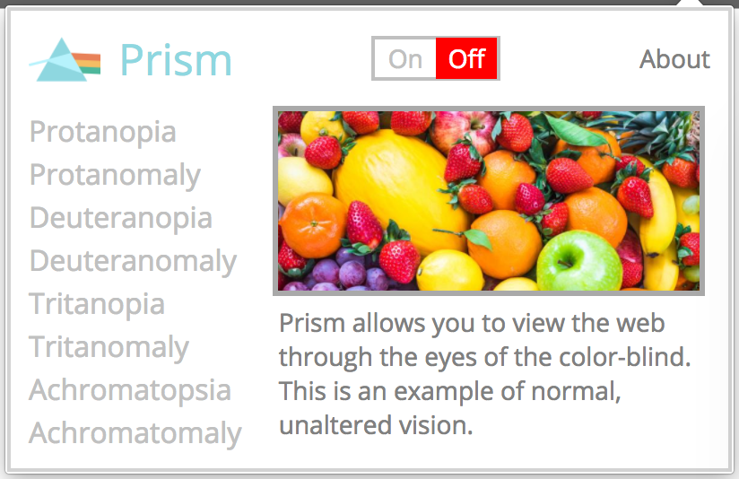

# Prism



Prism is a Chrome extension that simulates color-blindness when browsing the web. Users are able to select one of four different types of color-blindness in two degrees each (e.g., Protanopia and Protanomaly), effectively filtering all text, images, videos, backgrounds, and buttons on the current page.

The extension utilizes the following:

- Vanilla JavaScript
- jQuery
- HTML and CSS
- Scalable Vector Graphics (SVG)

# Features


Current features of the Prism include:

* [X] An open-source Chrome extension
* [X] Eight selectable filters to simulate a particular type of color-blindness
* [X] Detailed previews and descriptions of each color-blindness
* [X] Storage of the previously-chosen filter
* [X] An on/off switch

### Altering page elements via SVG filters

Before modifying the web page (i.e., filtering the elements), an SVG script containing color values as defined by the [Color Matrix Library](http://web.archive.org/web/20081014161121/http://www.colorjack.com/labs/colormatrix/) is injected directly into the web page itself. This prevents any cross-origin security restrictions of using an external SVG file, as domains, protocols, and ports must match.

An example of the color values mixed by the Color Matrix Library is as shown below. In particular, every fifth index represents output channels of red, blue, green, alpha, and key (respectively).

```javascript
 'Normal':        [1,0,0,0,0, 0,1,0,0,0, 0,0,1,0,0, 0,0,0,1,0, 0,0,0,0,1],
 'Protanopia':    [0.567,0.433,0,0,0, 0.558,0.442,0,0,0, 0,0.242,0.758,0,0, 0,0,0,1,0, 0,0,0,0,1],
 'Protanomaly':   [0.817,0.183,0,0,0, 0.333,0.667,0,0,0, 0,0.125,0.875,0,0, 0,0,0,1,0, 0,0,0,0,1],
 'Deuteranopia':  [0.625,0.375,0,0,0, 0.7,0.3,0,0,0, 0,0.3,0.7,0,0, 0,0,0,1,0, 0,0,0,0,1],
 'Deuteranomaly': [0.8,0.2,0,0,0, 0.258,0.742,0,0,0, 0,0.142,0.858,0,0, 0,0,0,1,0, 0,0,0,0,1],
 'Tritanopia':    [0.95,0.05,0,0,0, 0,0.433,0.567,0,0, 0,0.475,0.525,0,0, 0,0,0,1,0, 0,0,0,0,1],
 'Tritanomaly':   [0.967,0.033,0,0,0, 0,0.733,0.267,0,0, 0,0.183,0.817,0,0, 0,0,0,1,0, 0,0,0,0,1],
 'Achromatopsia': [0.299,0.587,0.114,0,0, 0.299,0.587,0.114,0,0, 0.299,0.587,0.114,0,0, 0,0,0,1,0, 0,0,0,0,1],
 'Achromatomaly': [0.618,0.320,0.062,0,0, 0.163,0.775,0.062,0,0, 0.163,0.320,0.516,0,0,0,0,0,1,0,0,0,0,0]
 ```

As the user selects a type of color-blindness, Prism is able to modify the page by using CSS' `filter` property. This property is injected into the page as well. Then, when coupled with a `url` value pointing to a particular portion of the SVG (e.g., the `id` of "protanopia"), the filter is applied to all elements of the page: text, images, videos, backgrounds, and buttons alike.

### Interactions between extension (popup) and page content

The primary goal of the Popup scripts (popup.js) is to send requests to the another part of the extension. As the user selects a pre-defined filter in the popup page, this option is captured and passed along to Prism's Content scripts (content.js).

```javascript
const setFilter = (image, filter) => {
  setActive(filter);

  // capturing the user-selected filter
  let filterDes = document.getElementById('filter-description');
  filterDes.innerHTML = descriptions[filter];

  // filtering the popup.html page
  let filterURL = `url('#${filter.toLowerCase()}')`;
  image.style.filter = filterURL;

  // sending the request (a POJO with an action and 'type' payload) to the Content scripts
  chrome.tabs.getSelected(function(tab){
    chrome.tabs.sendMessage(tab.id, {
      action: 'render',
      type: filter
    });
  });
};
```

In turn, these Content scripts inject code directly into the web page, achieving the desired filter effects.

```javascript
chrome.runtime.onMessage.addListener(
  function(message, sender, sendResponse){
    if( message.action === 'render' && message.type !== ''){
      addFilter(message.type);
      sendResponse(true);
    }
    else {
      revertColors();
      sendResponse(true);
    }
  }
);
```

### Future Release
* [ ] Additional filters for general page modification (blurring, sepia tone, etc.)
* [ ] Modification of individual elements (e.g. photos-only)
